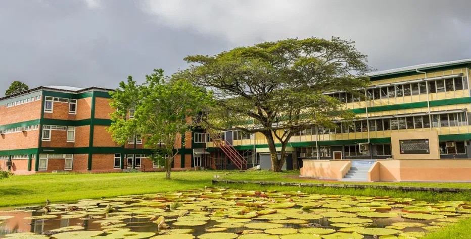

---
#
# By default, content added below the "---" mark will appear in the home page
# between the top bar and the list of recent posts.
# To change the home page layout, edit the _layouts/home.html file.
# See: https://jekyllrb.com/docs/themes/#overriding-theme-defaults
#
layout: home
---

#                                  University of Guyana Digital Library   
 

 
 

 
**Message from Ms Gwyneth George, University Librarian**    
                                                                                                                                                                      
*The Library remains committed to serving you, our users, to the improvement of our services and to the improvement of the access and  
delivery of information. Through this site, we aim to provide you with an array of information that keeps you in touch with information 
sources, regardless of the medium in which it is packaged*